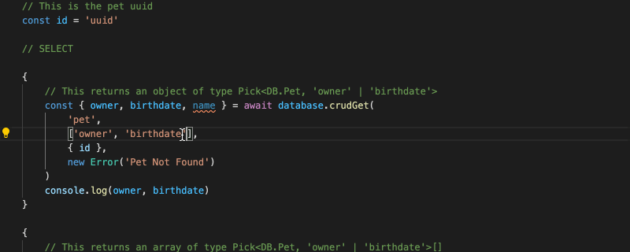

# Typed Postgres

A very thin layer on top of the awesome [pg-node](https://www.npmjs.com/package/pg) library that also provides types.

Design Principles:

- Avoid using heavyweight ORMs or complex query builders
- Let typescript help you auto-complete and verify your queries
- Be as lightweight as possible, no Code inspection is required
- Provide basic crud commands out of the box, handroll more complex queries with a couple of small helper functions

# The idea behind the library

The general idea behind the library is to combine the power of [shemats](https://github.com/vramework/schemats)
to describe your database types and then use those to help developers do simple database commands.

This library isn't meant to compete with any ORM, and can't even be seen as a diet version of [slonik](https://github.com/gajus/slonik). This library is more of just a way for developers who like using [pg-node](https://www.npmjs.com/package/pg) to continue doing so with some typescript support.


Example code helps best tho:



Setting up requires:

- A postgres db
- Schemats
- This library

Given the following SQL:

```sql
CREATE TYPE "pet_store"."animal" AS enum (
  'cat',
  'dog'
);

CREATE TABLE "pet_store"."user" (
  "id" uuid PRIMARY KEY default gen_random_uuid(),
  "name" text NOT NULL
);

CREATE TABLE "pet_store"."pet" (
  "id" uuid PRIMARY KEY default gen_random_uuid(),
  "owner" uuid REFERENCES "pet_store"."user",
  "type" pet_store.animal NOT NULL,
  "name" text NOT NULL,
  "birthdate" date,
  "last_seen_location" point,
  "random_facts" jsonb,
  "more_random_facts" jsonb
);
COMMENT ON COLUMN pet_store.pet.random_facts is '@type {RandomPetFacts}';
```

Which schemats will produce the following types from:

```typescript
import { RandomPetFacts } from './db-custom-types'

export enum Animal {
    Cat = 'cat',
    Dog = 'dog' 
}

export interface User { 
    id: string
    name: string 
}

export interface Pet { 
    id: string
    owner?: string | null
    type: Animal
    name: string
    birthdate?: Date | null
    lastSeenLocation?: { x: number, y: number } | null
    randomFacts?: RandomPetFacts | null
    moreRandomFacts?: unknown | null 
}

export interface Tables {
    user: User,
    pet: Pet
}

export type CustomTypes = RandomPetFacts
```


And then just pass those types to the postgres driver:

```typescript
import pino from 'pino'
import pg from 'pg'
// This file is automatically generated using schemats

import { Tables, CustomTypes, Animal } from './db-types'
import { TypedPostgresPool, TypedPostgresClient } from '../src'

const main = async () => {
    const logger = pino()

    // This creates 
    const connectionParams: pg.PoolConfig = {}
    const pool = new TypedPostgresPool<Tables, CustomTypes>(connectionParams, logger)
    const database = new TypedPostgresClient(pool, logger)

    // This is the pet uuid
    const id = 'uuid'

    // SELECT

    {
        // This returns an object of type Pick<DB.Pet, 'owner' | 'birthdate'>
        const { owner, birthdate } = await database.crudGet(
            'pet', 
            ['owner', 'birthdate'], 
            { id }, 
            new Error('Pet Not Found')
        )
        console.log(owner, birthdate)
    }

    {
        // This returns an array of type Pick<DB.Pet, 'owner' | 'birthdate'>[]
        const results = await database.crudGet(
            'pet', 
            ['owner', 'birthdate'], 
            { id }
        )
        console.log(results)
    }

    {
        // This returns an array of type DB.Pet
        const { owner, birthdate } = await database.crudGetAll(
            'pet', 
            { id },
            new Error('Pet Not Found')
        )
        console.log(owner, birthdate)
    }

    {
        // This returns an array of type DB.Pet[]
        const results = await database.crudGetAll(
            'pet', 
            { id }
        )
        console.log(results)
    }

    // UPDATE

    // This updates the pet
    await database.crudUpdate('pet', {
        lastSeenLocation: { x: 50, y: 20 }
    }, { id })

    // This updates the pet but throws an error if it isn't exactly
    // one pet that was updated
    await database.crudUpdate('pet', {
        lastSeenLocation: { x: 50, y: 20 }
    }, { id }, new Error('Pet not updated'))

    // INSERT

    // This inserts the pet and returns the id
    {
        const { id: petId } = await database.crudInsert('pet', {
            name: 'Bob',
            type: Animal.Dog
        }, ['id'])
        console.log(petId)
    }

    // DELETE

    // This delets the pet and returns whatever values
    await database.crudDelete('pet', { id }, ['id'], new Error('Pet not Found'))

    // Basic Query Helpers

    // Currently we just provide createFields and selectField methods
    await database.query<any>(
        ({ cf, sf }) => `
            SELECT 
                ${sf('pet', ['id', 'name'], 'p')}, 
                json_build_object(
                    'pet': json_build_object(${cf('pet', ['id', 'name'], 'p')}),
                    'owner': json_build_object(${cf('user', ['id', 'name'])})
                )
            FROM pet_store.pet as p
            JOIN pet_store.user on user.id = pet.owner
            WHERE name = $1
        `,
        ['bob']
    )
    
    // But you can also use the normal pg-node query
    await database.query(`SELECT * FROM pet_store`)

    // With .one and .many as utils
    await database.one(`SELECT * FROM pet_store`, ['name'], new Error('Not Found'))

    // With .one and .many as utils
    await database.many(`SELECT * FROM pet_store`, ['name'])
}

main()
```

### API Docs

Coming soon, still improving on library APIs

### To Run:

You can run the example code by:

- first creating the schema in Postgres
- yarn run example:schema

and then playing around with the example/example.ts file

### Tests

I haven't yet written tests specifically for this libray, as it is consumed by some much
larger libraries with backend tests. However the crud functions and specifically the 
query expression (not yet documentated) will have tests added shortly.

### Extra functionality

Theres actually some further functionality such as:
 - all operations are in a transaction, which is required to rollback if more than one thing is updated
 - transactions sets a user sessions variables which is used for audit logs
 - you can write generic filters which gets transformed into SQL queries. This isn't
  exposed since the aim of the library is to stick to SQL as much as possible, but
  to be honest the code becomes repetitive and having a simple query builder helps alot.
 - pools also have crudGet / crudGetAll / query API since you don't need a specific client nor transaction

### Production usage

Use with a tablespoon of salt. I have been using this in production for over a year and it works fine, but I rely on schemas and filter validation on a higher API level

Thanks!
